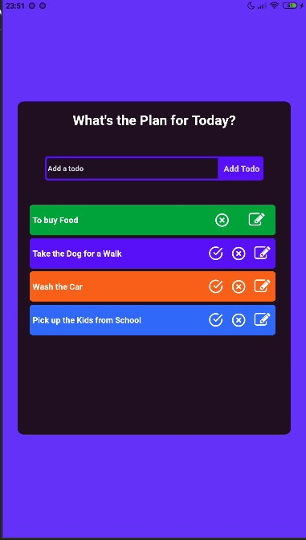
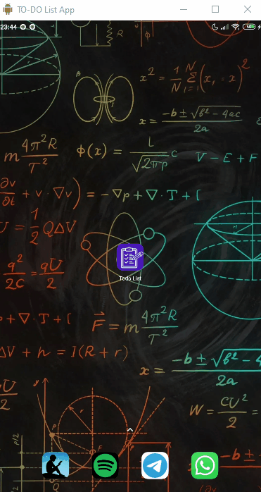

# A React Native App To-Do List

   

## How Does is Work? 🤔

   

<h2><strong>Technologies</strong></h2>

<ul>
  <li>
    <strong>
      React Native 👑
    </strong>
    <ul>
      <li>
        <strong>
          Expo 🧙‍♂️
        </strong>
        <ul>
          <li>
            <strong>
              React Hooks <small>🎩</small>🐇
            </strong>
            <ul>
              <li>
                <strong>
                  Context API ✌😎
                </strong>
                <ul>
                  <li>
                    <strong>
                      ListContext 💪
                    </strong>
                  </li>
                </ul>
              </li>
              <li>
                <strong>
                  UseEffect 😜
                </strong>
              </li>
              <li>
                <strong>
                  useState 😉
                </strong>
              </li>
              <li>
                <strong>
                  Custom Hooks 😍
                </strong>
                <ul>
                  <li>
                    <strong>
                      useLocalStorage 💝
                    </strong>
                  </li>
                  <li>
                    <strong>
                      useList 🐱‍👤
                    </strong>
                  </li>
                </ul>
              </li>
            </ul>
          </li>
          <li>
            <strong>
              LocalStorage 💖
            </strong>
          </li>
        </ul>
      </li>
    </ul>
  </li>
</ul>